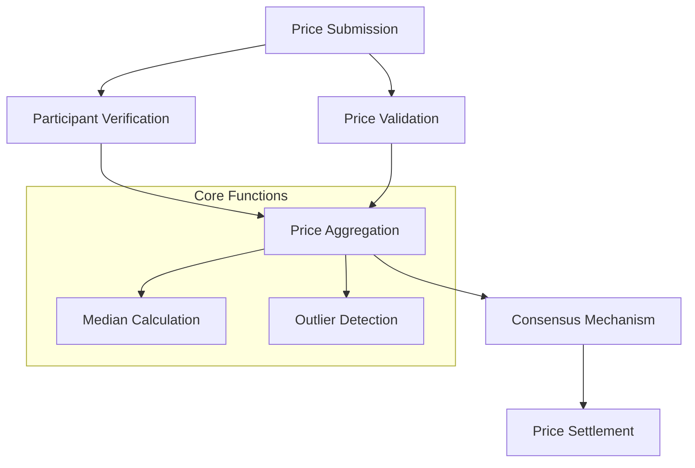

# Price Connect: Decentralized Price Oracle

Price Connect is a Clarity-powered smart contract solution that provides a transparent, trustless mechanism for tracking, sharing, and settling price information across multiple participants on the Stacks blockchain.

## Overview

Price Connect enables:
- Decentralized price tracking
- Transparent price sharing
- Collaborative price verification
- Trustless price settlement mechanisms
- Immutable price record keeping
- Cross-participant price consensus

## Architecture

The system is built around a core price oracle contract that manages price submissions, verification, and consensus. Here's how the components work together:



### Core Components:
- **Price Submissions**: Individual price data points
- **Participants**: Entities providing price information
- **Consensus Mechanism**: Algorithmic price validation
- **Settlements**: Price information verification
- **Historical Records**: Immutable price tracking

## Contract Documentation

### Price Oracle Contract (`price-oracle.clar`)

The main contract handling price tracking, verification, and settlement.

#### Key Features:
- Decentralized price submission
- Multi-participant price verification
- Consensus-based price determination
- Historical price tracking
- Stake-based reputation system

#### Access Control:
- Open participation for price submissions
- Consensus-driven price validation
- Reputation-based weighting

## Getting Started

### Prerequisites
- Clarinet installation
- Stacks wallet for deployment

### Basic Usage

1. Submit a price point:
```clarity
(contract-call? .price-oracle submit-price u100 "BTC/USD")
```

2. Get current price:
```clarity
(contract-call? .price-oracle get-current-price "BTC/USD")
```

3. Verify price consensus:
```clarity
(contract-call? .price-oracle validate-price-consensus "BTC/USD")
```

## Function Reference

### Price Submission

```clarity
(submit-price (price uint) (asset-pair (string-ascii 20)))
(get-current-price (asset-pair (string-ascii 20)))
```

### Consensus Mechanisms

```clarity
(validate-price-consensus (asset-pair (string-ascii 20)))
(calculate-median-price (asset-pair (string-ascii 20)))
```

## Development

### Testing
1. Clone the repository
2. Install dependencies: `clarinet install`
3. Run tests: `clarinet test`

### Local Development
1. Start local chain: `clarinet console`
2. Deploy contracts: `clarinet deploy`

## Security Considerations

### Limitations
- Price submissions require stake
- Maximum participants per price point
- Consensus threshold requirements
- Median calculation with outlier detection

### Best Practices
- Maintain high-quality price submissions
- Stake reputation on accurate information
- Participate consistently
- Validate before submission

The system enforces validation checks for:
- Participant reputation
- Price submission validity
- Consensus mechanism integrity
- Historical price accuracy